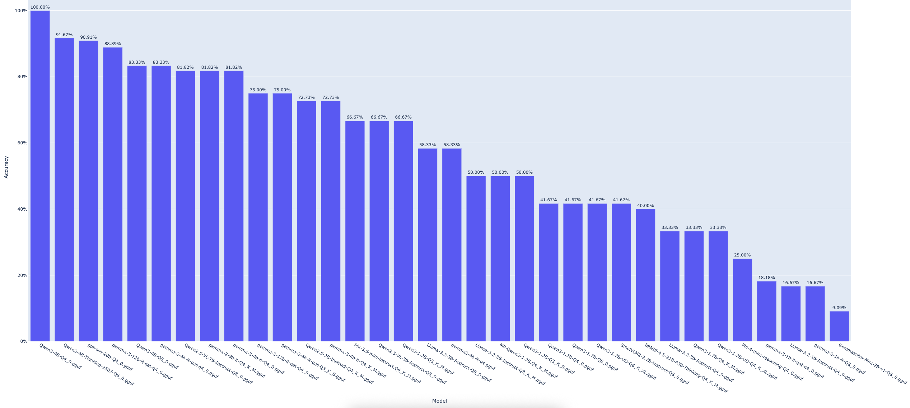

# TagDig

<div align="center">
  
</div>

A local email classifier inspired by the Persian food "TahDig". TagDig uses small large language models to tag, classify and organize your personal emails without any data leaving your device.

## Features

TagDig will support email classification into the following categories:

1. **Job Application Emails** - Identifies recruitment and job-related correspondence
2. **Meeting Emails** - Detects meeting invitations and scheduling communications

More categories coming soon.

## Job Application Classification

Our current focus is on **Job application-related emails**. We are actively benchmarking different models and prompts to optimize performance.

### Benchmarking

#### Experiment #1:

We benchmarked 35 models across 12 prompts (`temperature: 0.1`, `top_p: 0.99`).
**Qwen3-4B-Q4_0.gguf** performed the best. Here are the full results:

<div align="center">
  
</div>

| model | accuracy_pct | attempts |
| --- | --- | --- |
| Qwen3-4B-Q4_0.gguf | 100.00% | 12 |
| Qwen3-4B-Thinking-2507-Q8_0.gguf | 91.67% | 12 |
| gpt-oss-20b-Q4_0.gguf | 90.91% | 11 |
| gemma-3-12b-it-qat-q4_0.gguf | 88.89% | 9 |
| Qwen3-4B-Q5_0.gguf | 83.33% | 12 |
| gemma-3-4b-it-qat-q4_0.gguf | 83.33% | 12 |
| Qwen2.5-VL-7B-Instruct-Q8_0.gguf | 81.82% | 11 |
| gemma-2-9b-it-Q4_K_M.gguf | 81.82% | 11 |
| gemma-3-4b-it-Q4_0.gguf | 81.82% | 11 |
| gemma-3-12b-it-qat-Q4_0.gguf | 75.00% | 12 |
| gemma-3-4b-it-qat-Q3_K_S.gguf | 75.00% | 12 |
| Qwen2.5-7B-Instruct-Q4_K_M.gguf | 72.73% | 11 |
| gemma-3-4b-it-Q4_K_M.gguf | 72.73% | 11 |
| Phi-3.5-mini-instruct.Q4_K_M.gguf | 66.67% | 12 |
| Qwen2.5-VL-3B-Instruct-Q8_0.gguf | 66.67% | 12 |
| Qwen3-1.7B-Q5_K_M.gguf | 66.67% | 12 |
| Llama-3.2-3B-Instruct-Q8_0.gguf | 58.33% | 12 |
| gemma3-4b-it-q4.gguf | 58.33% | 12 |
| Llama-3.2-3B-Instruct-Q3_K_M.gguf | 50.00% | 12 |
| MP-Qwen3-1.7B.Q4_K_M.gguf | 50.00% | 12 |
| Qwen3-1.7B-Q3_K_S.gguf | 50.00% | 12 |
| Qwen3-1.7B-Q4_0.gguf | 41.67% | 12 |
| Qwen3-1.7B-Q8_0.gguf | 41.67% | 12 |
| Qwen3-1.7B-UD-Q6_K_XL.gguf | 41.67% | 12 |
| SmolVLM2-2.2B-Instruct-Q8_0.gguf | 41.67% | 12 |
| ERNIE-4.5-21B-A3B-Thinking-Q4_K_M.gguf | 40.00% | 10 |
| Llama-3.2-3B-Instruct-Q4_0.gguf | 33.33% | 12 |
| Qwen3-1.7B-Q4_K_M.gguf | 33.33% | 12 |
| Qwen3-1.7B-UD-Q4_K_XL.gguf | 33.33% | 12 |
| Phi-4-mini-reasoning-Q4_0.gguf | 25.00% | 12 |
| gemma-3-1b-it-qat-q4_0.gguf | 18.18% | 11 |
| Llama-3.2-1B-Instruct-Q4_0.gguf | 16.67% | 12 |
| gemma-3-1b-it-Q8_0.gguf | 16.67% | 12 |
| Gemmasutra-Mini-2B-v1-Q8_0.gguf | 9.09% | 11 |

**Prompts**

| prompt_id | accuracy_pct | distinct_models | n |
| --- | --- | --- | --- |
| PROMPT_11 | 85.29% | 34 | 34 |
| PROMPT_2 | 81.25% | 32 | 32 |
| PROMPT_9 | 73.53% | 34 | 34 |
| PROMPT_1 | 68.00% | 25 | 25 |
| PROMPT_10 | 66.67% | 33 | 33 |
| PROMPT_4 | 61.76% | 34 | 34 |
| PROMPT_3 | 60.61% | 33 | 33 |
| PROMPT_6 | 50.00% | 34 | 34 |
| PROMPT_5 | 44.12% | 34 | 34 |
| PROMPT_8 | 41.18% | 34 | 34 |
| PROMPT_12 | 29.41% | 34 | 34 |
| PROMPT_7 | 23.53% | 34 | 34 |


<details>
  <summary>Prompts Full Text</summary>

  ```
PROMPT_1 = """You are classifying emails related to job-application workflows.

Decide two things from the subject and body:
1) Is this email related to a specific job application you submitted? (true/false)
2) If true, pick exactly one status:
   SUBMITTED | REJECTED | FIRST_INTERVIEW_INVITATION | SUBSEQUENT_INTERVIEW_INVITATION | OFFER_LETTER
   If unrelated, use NOT_APPLICABLE.

Notes:
- "Let’s connect" / "quick chat" / "availability this week" as first contact about your application → FIRST_INTERVIEW_INVITATION.
- If the invite references a prior round (e.g., "after your phone screen") → SUBSEQUENT_INTERVIEW_INVITATION.
- Offer language includes "extend an offer", "offer letter", "accept/decline".
- Rejection language includes "won’t be moving forward", "role has been filled".
- Submission confirmations include "we received your application".

Output exactly:
<boolean>,<STATUS>

Classify this email now:
Subject: Quick chat regarding your application — Polar Robotics
Body: Thanks for applying! Our recruiter would love to connect for a 20-minute intro this week. Please share two time windows and we’ll send an invite."""

# true,FIRST_INTERVIEW_INVITATION


PROMPT_2 = """Classify job-application emails into one of the statuses.

Statuses:
SUBMITTED | REJECTED | FIRST_INTERVIEW_INVITATION | SUBSEQUENT_INTERVIEW_INVITATION | OFFER_LETTER | NOT_APPLICABLE

Instructions:
- Output ONLY: <boolean>,<STATUS>
- If not related to a specific application you submitted → false,NOT_APPLICABLE
- If related, output true,<one status>.

Heuristics:
- Mentions of "second-round", "onsite", "loop", "finals", or "next round" → SUBSEQUENT_INTERVIEW_INVITATION.

Email to classify:
Subject: Next steps after your phone screen — Luma Health
Body: We enjoyed speaking with you. We’d like to invite you to a 3-hour onsite loop next Tuesday with the team. Let us know your availability."""

# true,SUBSEQUENT_INTERVIEW_INVITATION


PROMPT_3 = """You determine if an email is about a job application and, if so, its status.

Allowed statuses:
SUBMITTED | REJECTED | FIRST_INTERVIEW_INVITATION | SUBSEQUENT_INTERVIEW_INVITATION | OFFER_LETTER | NOT_APPLICABLE

Rules:
- Unrelated → false,NOT_APPLICABLE
- Related → true,<STATUS>
- Output must be exactly one line: <boolean>,<STATUS>

Consider euphemistic phrasing (e.g., "we went in a different direction", "the role has been filled") as rejection.

Classify:
Subject: Update on your candidacy — Northwind
Body: Thank you for your interest and the time you spent interviewing with us. We’ve decided to move forward with other candidates and will keep your resume on file."""

# true,REJECTED


PROMPT_4 = """You are an email status classifier for job applications.

Statuses (choose exactly one if related): SUBMITTED | REJECTED | FIRST_INTERVIEW_INVITATION | SUBSEQUENT_INTERVIEW_INVITATION | OFFER_LETTER
If not related, use: NOT_APPLICABLE

Output (strict): <boolean>,<STATUS>

Guidance:
- Offer indicators: "extend an offer", "offer letter attached", "compensation", "accept/decline", "deadline to respond", "contingent upon background check" (still an offer).

Email:
Subject: Offer of Employment — Senior iOS Engineer at Aster
Body: We are pleased to extend you an offer with Aster! Attached is your formal offer letter with compensation details and start date, contingent upon background check. Please sign by Friday."""

# true,OFFER_LETTER


PROMPT_5 = """Job-application email classifier.

Output exactly one line: <boolean>,<STATUS>
Statuses: SUBMITTED | REJECTED | FIRST_INTERVIEW_INVITATION | SUBSEQUENT_INTERVIEW_INVITATION | OFFER_LETTER | NOT_APPLICABLE

Hints:
- Submission confirmations include "received your application", "thanks for applying", "application submitted", links to candidate portals.

Classify this:
Subject: Your application to Zephyr Analytics was received
Body: Thanks for applying to the Machine Learning Engineer role. Your application ID is ZA-48291. You can track your status in our candidate portal."""

# true,SUBMITTED


PROMPT_6 = """Determine (a) if this email is about a job application you submitted, and (b) the status if yes.

Statuses (if related): SUBMITTED | REJECTED | FIRST_INTERVIEW_INVITATION | SUBSEQUENT_INTERVIEW_INVITATION | OFFER_LETTER
If not related, use NOT_APPLICABLE.

Output strictly: <boolean>,<STATUS>

Reminder:
- Cold outreach, sourcing messages, general events, or newsletters from recruiters are NOT job-application related unless they reference your submitted application.

Email:
Subject: Join our Tech Careers AMA this Thursday!
Body: I’m a recruiter at OrbitIQ. We’re hosting an open Q&A about roles and interview prep. No application required — just RSVP to attend."""

# false,NOT_APPLICABLE

PROMPT_7 = """You are an email classifier for job applications.

Classification rules:
- Job-related emails: true,<STATUS>
- Non job-related: false,NOT_APPLICABLE

Valid statuses: SUBMITTED | REJECTED | FIRST_INTERVIEW_INVITATION | SUBSEQUENT_INTERVIEW_INVITATION | OFFER_LETTER

Key distinctions:
- SUBMITTED: Application acknowledgments, "under review", "in our system"
- FIRST_INTERVIEW_INVITATION: Initial screening, first contact for interview
- SUBSEQUENT_INTERVIEW_INVITATION: Any follow-up rounds after first interview
- Watch for indirect language and context clues

Output format: <boolean>,<STATUS> (one line only)

Classify this email:
Subject: Following up on our conversation
Body: Hi! Great chatting with you during the initial screen yesterday. The team would like to move forward with a technical interview. Can you do 2 hours next Monday with our engineering leads?"""

# true,SUBSEQUENT_INTERVIEW_INVITATION

PROMPT_8 = """Email classifier for job applications.

Status options:
SUBMITTED | REJECTED | FIRST_INTERVIEW_INVITATION | SUBSEQUENT_INTERVIEW_INVITATION | OFFER_LETTER | NOT_APPLICABLE

Critical edge cases:
- "On hold" or "waitlisted" → classify as SUBMITTED (still in process)
- "Not a fit right now but stay in touch" → REJECTED
- Requests for additional documents/references → SUBMITTED
- "Final round" or "meet the CEO" → SUBSEQUENT_INTERVIEW_INVITATION

Return: <boolean>,<STATUS>

Email to classify:
Subject: Update on your Designer application
Body: We've reviewed your portfolio and would like to keep your application on file. While we don't have an immediate opening, we expect positions to open up in Q2. We'll reach out if something becomes available."""

# true,SUBMITTED

PROMPT_9 = """Job application email classifier.

Instructions:
1. Determine if job-application related
2. Assign exact status from: SUBMITTED | REJECTED | FIRST_INTERVIEW_INVITATION | SUBSEQUENT_INTERVIEW_INVITATION | OFFER_LETTER | NOT_APPLICABLE

Tricky scenarios:
- Networking/informational interviews (not formal application) → NOT_APPLICABLE
- "Let's chat about opportunities" (vague) → if no prior application context, NOT_APPLICABLE
- Recruiter outreach about new position (not applied) → NOT_APPLICABLE

Output: <boolean>,<STATUS> only

Classify:
Subject: Quick question about your background
Body: Hi there! I'm a recruiter at TechGiant and came across your LinkedIn profile. Would you be open to a 15-minute call to discuss some exciting opportunities on our team? This could be a great fit for your skillset."""

# false,NOT_APPLICABLE

PROMPT_10 = """Classify job-application emails.

Statuses: SUBMITTED | REJECTED | FIRST_INTERVIEW_INVITATION | SUBSEQUENT_INTERVIEW_INVITATION | OFFER_LETTER | NOT_APPLICABLE

Special cases:
- Reference/background checks → treat as SUBMITTED (still processing)
- "Made it to final round" notifications → SUBMITTED (not yet an invitation)
- Automated system errors/glitches → NOT_APPLICABLE

Format: <boolean>,<STATUS>

Email:
Subject: Action required: Employment verification
Body: Congratulations on progressing in our hiring process! We need you to complete a background check and provide 3 professional references. Please use the link below within 48 hours. This is typically our final step before making decisions."""

# true,SUBMITTED

PROMPT_11 = """Email classification for job applications.

Valid outputs:
- true,SUBMITTED / true,REJECTED / true,FIRST_INTERVIEW_INVITATION / true,SUBSEQUENT_INTERVIEW_INVITATION / true,OFFER_LETTER
- false,NOT_APPLICABLE

Context clues:
- "Unfortunately" doesn't always mean REJECTED (could be rescheduling)
- "Next steps" could be any status - look at specifics
- Verbal offers without written confirmation → OFFER_LETTER

Classify this email (one line output):
Subject: Great news about the Software Engineer position!
Body: I just got off the phone with the hiring committee and they loved you! I'm calling to formally extend a verbal offer. The written offer letter will follow tomorrow with all the details, but wanted to share the good news immediately. The base salary will be $150,000."""

# true,OFFER_LETTER

PROMPT_12 = """Job application email classifier.

Categories: SUBMITTED | REJECTED | FIRST_INTERVIEW_INVITATION | SUBSEQUENT_INTERVIEW_INVITATION | OFFER_LETTER | NOT_APPLICABLE

Ambiguous scenarios:
- Mixed messages (e.g., "not this role but consider another") → REJECTED for current application
- Group assessment/hiring events → FIRST_INTERVIEW_INVITATION if first interaction
- "Coffee chat" after formal interviews → SUBSEQUENT_INTERVIEW_INVITATION

Return format: <boolean>,<STATUS>

Email to analyze:
Subject: RE: Marketing Manager position
Body: While we've decided to move forward with another candidate for the Marketing Manager role, we were impressed with your background. Would you consider our Marketing Analyst position instead? If interested, we can fast-track you to the final interview round."""

# true,REJECTED
  ```
</details>

#### Experiment #2:

From the previous experiment, we selected models with >50% accuracy, and also included more variants of **Qwen3-4B**. 

## License

This project is licensed under the Creative Commons Attribution-NonCommercial 4.0 International License (CC BY-NC 4.0).

## Contributing

We welcome contributions to TagDig.

