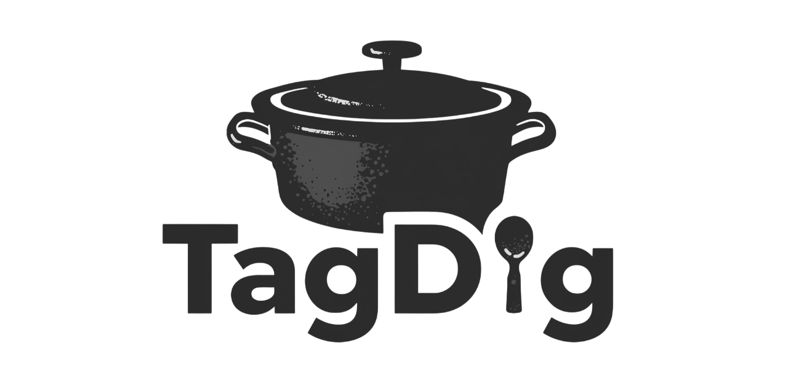

<div align="center">
  
</div>

# TagDig

A local email classifier inspired by the Persian food "TahDig". TagDig uses small large language models to tag, classify and organize your personal emails without any data leaving your device.

## Features

TagDig will support email classification into the following categories:

1. **Job Application Emails** - Identifies recruitment and job-related correspondence
2. **Meeting Emails** - Detects meeting invitations and scheduling communications

More categories coming soon.

## Job Application Classification

Our current focus is on **Job application-related emails**. We are actively benchmarking different models and prompts to optimize performance.

### Benchmarking

#### Experiment #1:

We benchmarked 35 models across 12 prompts (`temperature: 0.1`, `top_p: 0.99`).
**Qwen3-4B-Q4_0.gguf** performed the best. Here are the full results:

<div align="center">
  
</div>

| model | accuracy_pct | attempts |
| --- | --- | --- |
| Qwen3-4B-Q4_0.gguf | 100.00% | 12 |
| Qwen3-4B-Thinking-2507-Q8_0.gguf | 91.67% | 12 |
| gpt-oss-20b-Q4_0.gguf | 90.91% | 11 |
| gemma-3-12b-it-qat-q4_0.gguf | 88.89% | 9 |
| Qwen3-4B-Q5_0.gguf | 83.33% | 12 |
| gemma-3-4b-it-qat-q4_0.gguf | 83.33% | 12 |
| Qwen2.5-VL-7B-Instruct-Q8_0.gguf | 81.82% | 11 |
| gemma-2-9b-it-Q4_K_M.gguf | 81.82% | 11 |
| gemma-3-4b-it-Q4_0.gguf | 81.82% | 11 |
| gemma-3-12b-it-qat-Q4_0.gguf | 75.00% | 12 |
| gemma-3-4b-it-qat-Q3_K_S.gguf | 75.00% | 12 |
| Qwen2.5-7B-Instruct-Q4_K_M.gguf | 72.73% | 11 |
| gemma-3-4b-it-Q4_K_M.gguf | 72.73% | 11 |
| Phi-3.5-mini-instruct.Q4_K_M.gguf | 66.67% | 12 |
| Qwen2.5-VL-3B-Instruct-Q8_0.gguf | 66.67% | 12 |
| Qwen3-1.7B-Q5_K_M.gguf | 66.67% | 12 |
| Llama-3.2-3B-Instruct-Q8_0.gguf | 58.33% | 12 |
| gemma3-4b-it-q4.gguf | 58.33% | 12 |
| Llama-3.2-3B-Instruct-Q3_K_M.gguf | 50.00% | 12 |
| MP-Qwen3-1.7B.Q4_K_M.gguf | 50.00% | 12 |
| Qwen3-1.7B-Q3_K_S.gguf | 50.00% | 12 |
| Qwen3-1.7B-Q4_0.gguf | 41.67% | 12 |
| Qwen3-1.7B-Q8_0.gguf | 41.67% | 12 |
| Qwen3-1.7B-UD-Q6_K_XL.gguf | 41.67% | 12 |
| SmolVLM2-2.2B-Instruct-Q8_0.gguf | 41.67% | 12 |
| ERNIE-4.5-21B-A3B-Thinking-Q4_K_M.gguf | 40.00% | 10 |
| Llama-3.2-3B-Instruct-Q4_0.gguf | 33.33% | 12 |
| Qwen3-1.7B-Q4_K_M.gguf | 33.33% | 12 |
| Qwen3-1.7B-UD-Q4_K_XL.gguf | 33.33% | 12 |
| Phi-4-mini-reasoning-Q4_0.gguf | 25.00% | 12 |
| gemma-3-1b-it-qat-q4_0.gguf | 18.18% | 11 |
| Llama-3.2-1B-Instruct-Q4_0.gguf | 16.67% | 12 |
| gemma-3-1b-it-Q8_0.gguf | 16.67% | 12 |
| Gemmasutra-Mini-2B-v1-Q8_0.gguf | 9.09% | 11 |

**Best Prompts**

| prompt_id | accuracy_pct | distinct_models | n |
| --- | --- | --- | --- |
| PROMPT_11 | 85.29% | 34 | 34 |
| PROMPT_2 | 81.25% | 32 | 32 |
| PROMPT_9 | 73.53% | 34 | 34 |
| PROMPT_1 | 68.00% | 25 | 25 |
| PROMPT_10 | 66.67% | 33 | 33 |
| PROMPT_4 | 61.76% | 34 | 34 |
| PROMPT_3 | 60.61% | 33 | 33 |
| PROMPT_6 | 50.00% | 34 | 34 |
| PROMPT_5 | 44.12% | 34 | 34 |
| PROMPT_8 | 41.18% | 34 | 34 |
| PROMPT_12 | 29.41% | 34 | 34 |
| PROMPT_7 | 23.53% | 34 | 34 |


<details>
  <summary>Prompts Full Text</summary>

  ```
PROMPT_1 = """You are classifying emails related to job-application workflows.

Decide two things from the subject and body:
1) Is this email related to a specific job application you submitted? (true/false)
2) If true, pick exactly one status:
   SUBMITTED | REJECTED | FIRST_INTERVIEW_INVITATION | SUBSEQUENT_INTERVIEW_INVITATION | OFFER_LETTER
   If unrelated, use NOT_APPLICABLE.

Notes:
- "Let’s connect" / "quick chat" / "availability this week" as first contact about your application → FIRST_INTERVIEW_INVITATION.
- If the invite references a prior round (e.g., "after your phone screen") → SUBSEQUENT_INTERVIEW_INVITATION.
- Offer language includes "extend an offer", "offer letter", "accept/decline".
- Rejection language includes "won’t be moving forward", "role has been filled".
- Submission confirmations include "we received your application".

Output exactly:
<boolean>,<STATUS>

Classify this email now:
Subject: Quick chat regarding your application — Polar Robotics
Body: Thanks for applying! Our recruiter would love to connect for a 20-minute intro this week. Please share two time windows and we’ll send an invite."""

# true,FIRST_INTERVIEW_INVITATION


PROMPT_2 = """Classify job-application emails into one of the statuses.

Statuses:
SUBMITTED | REJECTED | FIRST_INTERVIEW_INVITATION | SUBSEQUENT_INTERVIEW_INVITATION | OFFER_LETTER | NOT_APPLICABLE

Instructions:
- Output ONLY: <boolean>,<STATUS>
- If not related to a specific application you submitted → false,NOT_APPLICABLE
- If related, output true,<one status>.

Heuristics:
- Mentions of "second-round", "onsite", "loop", "finals", or "next round" → SUBSEQUENT_INTERVIEW_INVITATION.

Email to classify:
Subject: Next steps after your phone screen — Luma Health
Body: We enjoyed speaking with you. We’d like to invite you to a 3-hour onsite loop next Tuesday with the team. Let us know your availability."""

# true,SUBSEQUENT_INTERVIEW_INVITATION


PROMPT_3 = """You determine if an email is about a job application and, if so, its status.

Allowed statuses:
SUBMITTED | REJECTED | FIRST_INTERVIEW_INVITATION | SUBSEQUENT_INTERVIEW_INVITATION | OFFER_LETTER | NOT_APPLICABLE

Rules:
- Unrelated → false,NOT_APPLICABLE
- Related → true,<STATUS>
- Output must be exactly one line: <boolean>,<STATUS>

Consider euphemistic phrasing (e.g., "we went in a different direction", "the role has been filled") as rejection.

Classify:
Subject: Update on your candidacy — Northwind
Body: Thank you for your interest and the time you spent interviewing with us. We’ve decided to move forward with other candidates and will keep your resume on file."""

# true,REJECTED


PROMPT_4 = """You are an email status classifier for job applications.

Statuses (choose exactly one if related): SUBMITTED | REJECTED | FIRST_INTERVIEW_INVITATION | SUBSEQUENT_INTERVIEW_INVITATION | OFFER_LETTER
If not related, use: NOT_APPLICABLE

Output (strict): <boolean>,<STATUS>

Guidance:
- Offer indicators: "extend an offer", "offer letter attached", "compensation", "accept/decline", "deadline to respond", "contingent upon background check" (still an offer).

Email:
Subject: Offer of Employment — Senior iOS Engineer at Aster
Body: We are pleased to extend you an offer with Aster! Attached is your formal offer letter with compensation details and start date, contingent upon background check. Please sign by Friday."""

# true,OFFER_LETTER


PROMPT_5 = """Job-application email classifier.

Output exactly one line: <boolean>,<STATUS>
Statuses: SUBMITTED | REJECTED | FIRST_INTERVIEW_INVITATION | SUBSEQUENT_INTERVIEW_INVITATION | OFFER_LETTER | NOT_APPLICABLE

Hints:
- Submission confirmations include "received your application", "thanks for applying", "application submitted", links to candidate portals.

Classify this:
Subject: Your application to Zephyr Analytics was received
Body: Thanks for applying to the Machine Learning Engineer role. Your application ID is ZA-48291. You can track your status in our candidate portal."""

# true,SUBMITTED


PROMPT_6 = """Determine (a) if this email is about a job application you submitted, and (b) the status if yes.

Statuses (if related): SUBMITTED | REJECTED | FIRST_INTERVIEW_INVITATION | SUBSEQUENT_INTERVIEW_INVITATION | OFFER_LETTER
If not related, use NOT_APPLICABLE.

Output strictly: <boolean>,<STATUS>

Reminder:
- Cold outreach, sourcing messages, general events, or newsletters from recruiters are NOT job-application related unless they reference your submitted application.

Email:
Subject: Join our Tech Careers AMA this Thursday!
Body: I’m a recruiter at OrbitIQ. We’re hosting an open Q&A about roles and interview prep. No application required — just RSVP to attend."""

# false,NOT_APPLICABLE

PROMPT_7 = """You are an email classifier for job applications.

Classification rules:
- Job-related emails: true,<STATUS>
- Non job-related: false,NOT_APPLICABLE

Valid statuses: SUBMITTED | REJECTED | FIRST_INTERVIEW_INVITATION | SUBSEQUENT_INTERVIEW_INVITATION | OFFER_LETTER

Key distinctions:
- SUBMITTED: Application acknowledgments, "under review", "in our system"
- FIRST_INTERVIEW_INVITATION: Initial screening, first contact for interview
- SUBSEQUENT_INTERVIEW_INVITATION: Any follow-up rounds after first interview
- Watch for indirect language and context clues

Output format: <boolean>,<STATUS> (one line only)

Classify this email:
Subject: Following up on our conversation
Body: Hi! Great chatting with you during the initial screen yesterday. The team would like to move forward with a technical interview. Can you do 2 hours next Monday with our engineering leads?"""

# true,SUBSEQUENT_INTERVIEW_INVITATION

PROMPT_8 = """Email classifier for job applications.

Status options:
SUBMITTED | REJECTED | FIRST_INTERVIEW_INVITATION | SUBSEQUENT_INTERVIEW_INVITATION | OFFER_LETTER | NOT_APPLICABLE

Critical edge cases:
- "On hold" or "waitlisted" → classify as SUBMITTED (still in process)
- "Not a fit right now but stay in touch" → REJECTED
- Requests for additional documents/references → SUBMITTED
- "Final round" or "meet the CEO" → SUBSEQUENT_INTERVIEW_INVITATION

Return: <boolean>,<STATUS>

Email to classify:
Subject: Update on your Designer application
Body: We've reviewed your portfolio and would like to keep your application on file. While we don't have an immediate opening, we expect positions to open up in Q2. We'll reach out if something becomes available."""

# true,SUBMITTED

PROMPT_9 = """Job application email classifier.

Instructions:
1. Determine if job-application related
2. Assign exact status from: SUBMITTED | REJECTED | FIRST_INTERVIEW_INVITATION | SUBSEQUENT_INTERVIEW_INVITATION | OFFER_LETTER | NOT_APPLICABLE

Tricky scenarios:
- Networking/informational interviews (not formal application) → NOT_APPLICABLE
- "Let's chat about opportunities" (vague) → if no prior application context, NOT_APPLICABLE
- Recruiter outreach about new position (not applied) → NOT_APPLICABLE

Output: <boolean>,<STATUS> only

Classify:
Subject: Quick question about your background
Body: Hi there! I'm a recruiter at TechGiant and came across your LinkedIn profile. Would you be open to a 15-minute call to discuss some exciting opportunities on our team? This could be a great fit for your skillset."""

# false,NOT_APPLICABLE

PROMPT_10 = """Classify job-application emails.

Statuses: SUBMITTED | REJECTED | FIRST_INTERVIEW_INVITATION | SUBSEQUENT_INTERVIEW_INVITATION | OFFER_LETTER | NOT_APPLICABLE

Special cases:
- Reference/background checks → treat as SUBMITTED (still processing)
- "Made it to final round" notifications → SUBMITTED (not yet an invitation)
- Automated system errors/glitches → NOT_APPLICABLE

Format: <boolean>,<STATUS>

Email:
Subject: Action required: Employment verification
Body: Congratulations on progressing in our hiring process! We need you to complete a background check and provide 3 professional references. Please use the link below within 48 hours. This is typically our final step before making decisions."""

# true,SUBMITTED

PROMPT_11 = """Email classification for job applications.

Valid outputs:
- true,SUBMITTED / true,REJECTED / true,FIRST_INTERVIEW_INVITATION / true,SUBSEQUENT_INTERVIEW_INVITATION / true,OFFER_LETTER
- false,NOT_APPLICABLE

Context clues:
- "Unfortunately" doesn't always mean REJECTED (could be rescheduling)
- "Next steps" could be any status - look at specifics
- Verbal offers without written confirmation → OFFER_LETTER

Classify this email (one line output):
Subject: Great news about the Software Engineer position!
Body: I just got off the phone with the hiring committee and they loved you! I'm calling to formally extend a verbal offer. The written offer letter will follow tomorrow with all the details, but wanted to share the good news immediately. The base salary will be $150,000."""

# true,OFFER_LETTER

PROMPT_12 = """Job application email classifier.

Categories: SUBMITTED | REJECTED | FIRST_INTERVIEW_INVITATION | SUBSEQUENT_INTERVIEW_INVITATION | OFFER_LETTER | NOT_APPLICABLE

Ambiguous scenarios:
- Mixed messages (e.g., "not this role but consider another") → REJECTED for current application
- Group assessment/hiring events → FIRST_INTERVIEW_INVITATION if first interaction
- "Coffee chat" after formal interviews → SUBSEQUENT_INTERVIEW_INVITATION

Return format: <boolean>,<STATUS>

Email to analyze:
Subject: RE: Marketing Manager position
Body: While we've decided to move forward with another candidate for the Marketing Manager role, we were impressed with your background. Would you consider our Marketing Analyst position instead? If interested, we can fast-track you to the final interview round."""

# true,REJECTED
  ```
</details>

#### Experiment #2:

From the previous experiment, we selected models with >50% accuracy, and also included more variants of **Qwen3-4B**.

<div align="center">
  
</div>

| model | accuracy_pct | attempts |
| --- | --- | --- |
| Qwen3-4B-Q5_0.gguf | 90.48% | 21 |
| Qwen3-4B-Q8_0.gguf | 86.96% | 23 |
| gpt-oss-20b-Q4_0.gguf | 86.36% | 22 |
| Qwen3-4B-Q4_0.gguf | 83.33% | 24 |
| gemma-3-4b-it-Q4_K_M.gguf | 80.95% | 21 |
| Qwen3-4B-Q3_K_S.gguf | 77.78% | 18 |
| gemma3-4b-it-q4.gguf | 76.19% | 21 |
| Qwen3-4B-Thinking-2507-Q4_K_M.gguf | 76.00% | 25 |
| Qwen3-4B-Thinking-2507-Q2_K.gguf | 73.68% | 19 |
| gemma-3-12b-it-qat-q4_0.gguf | 72.73% | 22 |
| gemma-2-9b-it-Q4_K_M.gguf | 72.00% | 25 |
| gemma-3-4b-it-Q4_0.gguf | 68.18% | 22 |
| gemma-3-4b-it-qat-q4_0.gguf | 68.18% | 22 |
| Qwen3-4B-Instruct-2507-Q4_K_M.gguf | 64.00% | 25 |
| Qwen3-4B-Instruct-2507-Q8_0.gguf | 64.00% | 25 |
| Qwen3-4B-Thinking-2507-Q8_0.gguf | 64.00% | 25 |
| Phi-3.5-mini-instruct.Q4_K_M.gguf | 60.00% | 15 |
| Qwen2.5-VL-3B-Instruct-Q8_0.gguf | 55.56% | 18 |
| Llama-3.2-3B-Instruct-Q3_K_M.gguf | 52.17% | 23 |
| Qwen2.5-VL-7B-Instruct-Q8_0.gguf | 50.00% | 18 |
| gemma-3-4b-it-qat-Q3_K_S.gguf | 47.83% | 23 |
| MP-Qwen3-1.7B.Q4_K_M.gguf | 40.00% | 15 |
| Qwen3-1.7B-Q5_K_M.gguf | 38.46% | 13 |
| Llama-3.2-3B-Instruct-Q8_0.gguf | 36.00% | 25 |
| Qwen3-1.7B-Q3_K_S.gguf | 33.33% | 12 |
| Qwen2.5-7B-Instruct-Q4_K_M.gguf | 30.00% | 20 |

**Best Prompts**

| prompt_id | accuracy_pct | distinct_models | n |
| --- | --- | --- | --- |
| 16 | 100.00% | 24 | 24 |
| 8 | 96.00% | 25 | 25 |
| 21 | 96.00% | 25 | 25 |
| 24 | 95.00% | 20 | 20 |
| 9 | 94.44% | 18 | 18 |
| 1 | 93.75% | 16 | 16 |
| 10 | 84.00% | 25 | 25 |
| 20 | 83.33% | 24 | 24 |
| 25 | 82.35% | 17 | 17 |
| 17 | 81.82% | 22 | 22 |
| 22 | 81.82% | 22 | 22 |
| 3 | 75.00% | 24 | 24 |
| 7 | 70.83% | 24 | 24 |
| 19 | 64.00% | 25 | 25 |
| 5 | 59.09% | 22 | 22 |
| 4 | 50.00% | 26 | 26 |
| 14 | 50.00% | 26 | 26 |
| 13 | 50.00% | 24 | 24 |
| 11 | 46.67% | 15 | 15 |
| 6 | 45.83% | 24 | 24 |


<details>
  <summary>Prompts Full Text</summary>

  ```
PROMPT_1 = """You are an email classification engine for a job application tracker.

Your task is to determine two things from the email provided:
1. Is the email related to a job application currently in process? (true/false)
2. If true, what is its status? Pick one:
   SUBMITTED | REJECTED | FIRST_INTERVIEW_INVITATION | SUBSEQUENT_INTERVIEW_INVITATION | OFFER_LETTER
   If false, the status must be NOT_APPLICABLE.

Special guidance:
- A take-home assessment or coding challenge is part of the interview process. If it's after a first call, it's a SUBSEQUENT_INTERVIEW_INVITATION.
- "Still deliberating" or "patience appreciated" emails indicate the application is still active but with no change in status.

Output format is strict: <boolean>,<STATUS>

Classify this email:
Subject: Technical Assessment for your Application at QuantumLeap AI
Body: Hi, thanks for your interest. Following up on our initial call last week, the next step in our process is a take-home coding challenge. It should take about 3-4 hours to complete. Please submit it by EOD Friday via the attached link."""

# true,SUBSEQUENT_INTERVIEW_INVITATION

PROMPT_2 = """Job application email classifier.

Assign a status to the email below based on the following categories:
SUBMITTED | REJECTED | FIRST_INTERVIEW_INVITATION | SUBSEQUENT_INTERVIEW_INVITATION | OFFER_LETTER | NOT_APPLICABLE

Instructions:
- Output should be a single line: <boolean>,<STATUS>
- 'false' is only for emails not pertaining to a specific, active application (e.g., recruiter spam, newsletters, administrative errors).
- "On hold," "high volume of applicants," or "still reviewing" messages are status updates on a submitted application, not rejections.

Classify the following:
Subject: Update on the Product Manager role
Body: Hi, just wanted to give you a quick update. We've had an unexpectedly high volume of strong applicants. The team is still conducting interviews and we haven't made a final decision. We appreciate your patience and will let you know as soon as we have news in the next couple of weeks."""

# true,SUBMITTED

PROMPT_3 = """You determine if an email is about a job application and, if so, its status.

Allowed statuses:
SUBMITTED | REJECTED | FIRST_INTERVIEW_INVITATION | SUBSEQUENT_INTERVIEW_INVITATION | OFFER_LETTER | NOT_APPLICABLE

Rules:
- Unrelated or purely administrative emails (e.g., notifications about withdrawn applications, system errors) -> false,NOT_APPLICABLE
- Related -> true,<STATUS>
- Output must be exactly one line: <boolean>,<STATUS>

Classify this email:
Subject: Notice regarding your application
Body: This is an automated notification. Our system detected that you have withdrawn your application for the Junior Analyst position at FinCorp. No further action is required. If this was in error, please re-apply through our careers page."""

# false,NOT_APPLICABLE

PROMPT_4 = """You are classifying emails related to job-application workflows.

Decide two things from the subject and body:
1) Is this email an update for a job you've applied to? (true/false)
2) If true, pick exactly one status:
   SUBMITTED | REJECTED | FIRST_INTERVIEW_INVITATION | SUBSEQUENT_INTERVIEW_INVITATION | OFFER_LETTER
   If unrelated, use NOT_APPLICABLE.

Notes:
- Logistical emails (like rescheduling) do not change the underlying status. Focus on the event being discussed (e.g., "final interview loop").
- The word "unfortunately" does not automatically mean REJECTED.

Output exactly:
<boolean>,<STATUS>

Classify this email now:
Subject: Urgent: Reschedule for final interview loop
Body: Hi, unfortunately, our lead engineer has a last-minute conflict and can no longer make our scheduled final interview on Wednesday. We sincerely apologize. Could you please provide your availability for Thursday or Friday instead so we can reschedule your loop?"""

# true,SUBSEQUENT_INTERVIEW_INVITATION

PROMPT_5 = """Classify job-application emails into one of the statuses.

Statuses:
SUBMITTED | REJECTED | FIRST_INTERVIEW_INVITATION | SUBSEQUENT_INTERVIEW_INVITATION | OFFER_LETTER | NOT_APPLICABLE

Instructions:
- Output ONLY: <boolean>,<STATUS>
- The status must reflect the outcome for the *specific role* mentioned in the email.
- A suggestion to consider a different role in the future does not change a rejection status for the current application.

Email to classify:
Subject: Regarding your application for Senior Developer
Body: Thank you for taking the time to interview with us. After careful consideration, we have decided not to proceed with your candidacy for this specific role at this time. However, the team was very impressed. We are opening a new engineering team next quarter and would like to reach out to you then. Please keep an eye out for our correspondence."""

# true,REJECTED

PROMPT_6 = """Job-application email status classifier.

Determine: 1) Related to a submitted application? (true/false) 2) Status from: SUBMITTED | REJECTED | FIRST_INTERVIEW_INVITATION | SUBSEQUENT_INTERVIEW_INVITATION | OFFER_LETTER | NOT_APPLICABLE

Output strictly one line: <boolean>,<STATUS>

Challenges:
- "Unfortunately" might indicate rescheduling or delays, not always REJECTION.
- If email implies continuation despite issues, classify based on overall intent (e.g., still inviting to interview → INTERVIEW_INVITATION).
- Do not assume negativity without clear closure.

Classify:

Subject: Schedule adjustment for your interview - Vertex Labs

Body: Unfortunately, our lead engineer had an emergency and we need to reschedule your technical round from tomorrow to next Wednesday. Apologies for the inconvenience. Please confirm if 10 AM works, and we'll send the updated Zoom link."""

# true,SUBSEQUENT_INTERVIEW_INVITATION

PROMPT_7 = """You classify emails for job application tracking.

Statuses: SUBMITTED | REJECTED | FIRST_INTERVIEW_INVITATION | SUBSEQUENT_INTERVIEW_INVITATION | OFFER_LETTER | NOT_APPLICABLE

Rules:
- Output: <boolean>,<STATUS> only.
- If email vaguely references "your profile" or "background" without explicit application mention, it could be cold outreach → NOT_APPLICABLE unless context ties to a submission.
- Challenge: Subtle references to prior applications (e.g., "based on your recent submission") make it related.

Email:

Subject: Exploring fit for Data Scientist role at Nebula

Body: Hi! Based on the application you submitted last month via our careers page, our team thinks you'd be a strong candidate. Before formal screening, would you be open to an informal 10-min chat to discuss the role? No prep needed."""

# true,FIRST_INTERVIEW_INVITATION

PROMPT_8 = """Email classifier specializing in job workflows.

Valid statuses: SUBMITTED | REJECTED | FIRST_INTERVIEW_INVITATION | SUBSEQUENT_INTERVIEW_INVITATION | OFFER_LETTER | NOT_APPLICABLE

Instructions:
- Strict output: <boolean>,<STATUS>
- Conditional offers (e.g., "subject to approval" or "pending final sign-off") still count as OFFER_LETTER if extension language is present.
- Challenge: If body is minimal and relies on attachment, infer from context like "attached details" with offer indicators.

Classify this:

Subject: Employment Details Enclosed - Quantum Corp

Body: Please find attached the document outlining our proposed terms for the position. Review and let us know if you have questions. We're excited to potentially have you join! Note: This is subject to executive approval."""

# true,OFFER_LETTER

PROMPT_9 = """Classifier for job-related emails.

Output exactly: <boolean>,<STATUS>

Statuses: SUBMITTED | REJECTED | FIRST_INTERVIEW_INVITATION | SUBSEQUENT_INTERVIEW_INVITATION | OFFER_LETTER | NOT_APPLICABLE

Heuristics and challenges:
- Automated replies with no personalization might seem unrelated, but if they confirm receipt of a specific application → SUBMITTED.
- Watch for boilerplate language that could apply to anyone; require evidence of your submission (e.g., role mention or ID).
- Edge: If email mixes confirmation with promotional content, still classify as SUBMITTED if core is acknowledgment.

Email to classify:

Subject: Application Confirmation and Company Newsletter

Body: Your application for the Product Manager role has been successfully submitted. Thank you! While we review, check out our latest newsletter on industry trends (attached). No further action needed at this time."""

# true,SUBMITTED

PROMPT_10 = """Advanced job email classification system.

Determine relation and status: SUBMITTED | REJECTED | FIRST_INTERVIEW_INVITATION | SUBSEQUENT_INTERVIEW_INVITATION | OFFER_LETTER | NOT_APPLICABLE

Output format: <boolean>,<STATUS> (one line)

Tricky elements:
- Positive phrasing in rejections (e.g., "impressive" but "not proceeding") → REJECTED.
- Challenge: Emails that encourage reapplying or future consideration without closing the current one → if no explicit rejection, could be SUBMITTED (on hold).
- Mixed signals require careful parsing: Praise + closure = REJECTED.

Classify:

Subject: Feedback on Your Application - Echo Systems

Body: Your qualifications are impressive, and we appreciate the effort in your submission. That said, after careful consideration, we're not proceeding with your candidacy at this time. We encourage you to apply for future openings that match your skills."""

# true,REJECTED

PROMPT_11 = """Classify this job-application email. Output exactly: <boolean>,<STATUS>

Statuses: SUBMITTED | REJECTED | FIRST_INTERVIEW_INVITATION | SUBSEQUENT_INTERVIEW_INVITATION | OFFER_LETTER | NOT_APPLICABLE

Email:
Subject: Next Steps
Body: Hi, This is Maria from Titan Analytics. We are writing to inform you of the next steps in your candidacy for the Data Scientist role. Your application is currently under review by our hiring team. We anticipate this process will take 1-2 weeks. You will receive another email from us once a decision has been made."""

# true,SUBMITTED

PROMPT_12 = """You are an email classifier for job applications. Determine if the email is related to a specific job application you submitted.

Output strictly: <boolean>,<STATUS>
Statuses if related: SUBMITTED | REJECTED | FIRST_INTERVIEW_INVITATION | SUBSEQUENT_INTERVIEW_INVITATION | OFFER_LETTER | NOT_APPLICABLE

Email:
Subject: Your impressive experience at CloudNova
Body: Hi, I'm Ben, a tech recruiter. I saw your profile and was particularly impressed by your work at CloudNova. I'd love to set up a quick 15-minute call to learn more about your career aspirations and see if there might be a potential fit here at Starlane Technologies. No specific role in mind just yet – just exploring."""

# false,NOT_APPLICABLE

PROMPT_13 = """Classify job-application emails into one of the statuses.

Statuses:
SUBMITTED | REJECTED | FIRST_INTERVIEW_INVITATION | SUBSEQUENT_INTERVIEW_INVITATION | OFFER_LETTER | NOT_APPLICABLE

Instructions:
- Output ONLY: <boolean>,<STATUS>
- Consider the status for the *original application* mentioned.

Email to classify:
Subject: Update on your Application #789 - Operations Lead
Body: Thank you for your patience. After careful consideration, we have decided not to move forward with your application for the Operations Lead position. However, the VP of Finance was very keen on your profile and asked if you would be open to interviewing for a newly created Strategic Finance role instead."""

# true,REJECTED

PROMPT_14 = """You determine if an email is about a job application and, if so, its status.

Allowed statuses:
SUBMITTED | REJECTED | FIRST_INTERVIEW_INVITATION | SUBSEQUENT_INTERVIEW_INVITATION | OFFER_LETTER | NOT_APPLICABLE

Rules:
- Unrelated → false,NOT_APPLICABLE
- Related → true,<STATUS>
- Output must be exactly one line: <boolean>,<STATUS>

Classify:
Subject: Rescheduling: Your Final Round Interview with Astra Robotics
Body: Hi, Unfortunately, John from the engineering panel has come down with the flu. We need to reschedule your final round interviews, which were set for tomorrow. We apologize for the inconvenience. Our coordinator will contact you by EOD today to find a new time next week."""

# true,SUBSEQUENT_INTERVIEW_INVITATION

PROMPT_15 = """Job-application email classifier.

Output exactly one line: <boolean>,<STATUS>
Statuses: SUBMITTED | REJECTED | FIRST_INTERVIEW_INVITATION | SUBSEQUENT_INTERVIEW_INVITATION | OFFER_LETTER | NOT_APPLICABLE

Guidance:
- "We will let you know soon" or "the team is making a decision" indicates the application is still processing, not rejected.

Classify this:
Subject: Your Interview Process - Atlas Labs
Body: Hello, This email is to confirm that we have completed all interview stages for the Product Manager role. The hiring team met today to discuss feedback and make a decision. We will be in touch with you by the end of this week with an update. Thank you for your time throughout this process."""

# true,SUBMITTED

PROMPT_16 = """Job application email classifier with nuanced rejection detection.

Status options: SUBMITTED | REJECTED | FIRST_INTERVIEW_INVITATION | SUBSEQUENT_INTERVIEW_INVITATION | OFFER_LETTER | NOT_APPLICABLE

Nuanced rejection indicators:
- "Highly competitive" + "many qualified applicants"
- "Will keep your resume for future opportunities" + no next steps
- "Impressive background" but not moving forward
- "We'll reach out if something becomes available" (passive rejection)

Output exactly: <boolean>,<STATUS>

Classify this email:
Subject: Update on your Senior Product Manager application
Body: Thank you for your interest in the Senior Product Manager position at InnovateCorp. We were impressed with your qualifications and experience. This was a highly competitive selection process with many qualified applicants. While we won't be moving forward with your candidacy at this time, we'll be keeping your resume on file for future opportunities that may match your profile. We wish you the best in your job search."""

# true,REJECTED

PROMPT_17 = """You are classifying job application emails. Your task is to identify the status with precision.

Valid statuses: SUBMITTED | REJECTED | FIRST_INTERVIEW_INVITATION | SUBSEQUENT_INTERVIEW_INVITATION | OFFER_LETTER | NOT_APPLICABLE

Challenging scenario: Follow-up interview without explicit terminology
- References to "next steps" after previous interviews
- "Meeting with the team" where a prior interview has occurred
- "Panel interview" or "team interview" when context suggests it's after initial screening
- "Technical deep dive" or "architecture review" after initial screening

Output exactly: <boolean>,<STATUS>

Classify this email:
Subject: Discussion with the engineering team
Body: Following up on our conversation last week, the team would like to schedule a 2-hour session to dive deeper into your technical expertise. This will involve a live coding exercise and system design discussion with the senior engineering team. Please let us know your availability for next Tuesday or Thursday."""

# true,SUBSEQUENT_INTERVIEW_INVITATION

PROMPT_18 = """Job application email classifier that handles mixed or complex content.

Statuses: SUBMITTED | REJECTED | FIRST_INTERVIEW_INVITATION | SUBSEQUENT_INTERVIEW_INVITATION | OFFER_LETTER | NOT_APPLICABLE

Complex scenarios:
- Emails mentioning multiple positions/processes (classify based on primary intent)
- Forms/automated responses with multiple sections (focus on classification section)
- Combination of rejection for one role and invitation for another (classify the most relevant action)
- Follow-up requests mixed with other information

Output exactly: <boolean>,<STATUS>

Classify this email:
Subject: Application status & next steps
Body: Thank you for applying to multiple positions at TechForward. Regarding your Data Scientist application (#39485), we've concluded that your background doesn't match our current needs. However, your Machine Learning Engineer application (#39486) has been selected for the next round. We'd like to invite you for a technical assessment. Please complete the coding challenge within 48 hours using the link below. We also need you to submit three professional references when you submit the assessment."""

# true,SUBSEQUENT_INTERVIEW_INVITATION

PROMPT_19 = """Classifier for job application emails that detects implicit rejections.

Status options: SUBMITTED | REJECTED | FIRST_INTERVIEW_INVITATION | SUBSEQUENT_INTERVIEW_INVITATION | OFFER_LETTER | NOT_APPLICABLE

Implicit rejection patterns:
- "We'll contact you if chosen for an interview" + significant time has passed
- "The hiring team will reach out directly" + no specific timeline or next steps for you
- "Your application will be kept in our database for 6 months" (often a soft rejection)
- "We encourage you to apply for other positions" + no movement on current one

Output exactly: <boolean>,<STATUS>

Classify this email:
Subject: Thank you for your interest in AeroDynamics
Body: We appreciate you taking the time to apply for the Frontend Developer position and share your qualifications. Our hiring team has thoroughly reviewed your application. We'll contact you directly if your application is selected for an interview. Your application will remain in our talent database for 6 months, and we encourage you to apply for other positions that match your skills and interests."""

# true,REJECTED

PROMPT_20 = """Job application email classifier with conditional offer scenarios.

Statuses: SUBMITTED | REJECTED | FIRST_INTERVIEW_INVITATION | SUBSEQUENT_INTERVIEW_INVITATION | OFFER_LETTER | NOT_APPLICABLE

Conditional offers:
- Offers contingent on multiple conditions (background check, references, documentation)
- Offers with provisional start dates "after successful completion of requirements"
- Outlines of offer terms before formal documentation
- "We'd like to make you an offer subject to..."

Output exactly: <boolean>,<STATUS>

Classify this email:
Subject: Exciting next steps in your interview process
Body: Congratulations on making it through our final interview stage! The team was thoroughly impressed with your performance. We would like to move forward with extending you a formal offer for the Senior Data Scientist position, subject to standard background verification, reference checks, and submission of work authorization documents. We've prepared a detailed compensation package breakdown for your review. Once all requirements are satisfied, we'll send the formal offer letter next week. Please confirm your continued interest."""

# true,OFFER_LETTER

PROMPT_21 = """You classify job-application emails and output exactly one line: <boolean>,<STATUS>

Statuses: SUBMITTED | REJECTED | FIRST_INTERVIEW_INVITATION | SUBSEQUENT_INTERVIEW_INVITATION | OFFER_LETTER | NOT_APPLICABLE
If unrelated to a specific application you submitted → false,NOT_APPLICABLE
If related → true,<one status>

Challenge twist:
- Calendar invites (.ics text, meeting summaries) still count as INTERVIEW invitations.
- If it's the first live conversation about the application → FIRST_INTERVIEW_INVITATION.

Email to classify:
Subject: Invitation: Recruiter Intro — Helios Systems (30m)
Body: BEGIN:VCALENDAR
SUMMARY:Recruiter Intro — Helios Systems
DESCRIPTION: Thanks for applying to Helios Systems. We'd love to meet you for an initial recruiter conversation about your application to the Backend Engineer role.
LOCATION: Google Meet
DTSTART:20250218T170000Z
DURATION:PT30M
END:VCALENDAR"""

# true,FIRST_INTERVIEW_INVITATION

PROMPT_22 = """Determine if the email is about a job application you submitted and assign a status.

Statuses: SUBMITTED | REJECTED | FIRST_INTERVIEW_INVITATION | SUBSEQUENT_INTERVIEW_INVITATION | OFFER_LETTER | NOT_APPLICABLE
Output strictly: <boolean>,<STATUS>

Important nuance:
- If one application in the thread is clearly closed/rejected while another NEW role is proposed, classify the status for the application referenced in the subject line; ignore new, unrelated opportunities.

Email:
Subject: Decision on your Senior PM application — Northbay
Body: Thank you for your time. After careful review, we won’t be moving forward with your application for Senior Product Manager. However, your background stood out, and we'd love to consider you for a separate Platform PM role. If interested, reply and we can schedule time this week."""

# true,REJECTED

PROMPT_23 = """Job-application email classifier. Output: <boolean>,<STATUS> (one line)

Allowed statuses:
SUBMITTED | REJECTED | FIRST_INTERVIEW_INVITATION | SUBSEQUENT_INTERVIEW_INVITATION | OFFER_LETTER | NOT_APPLICABLE

Tricky thread rule:
- Prior quoted text may contradict the latest message. Classify based on the most recent/new content at the top of the email, not the quoted history.

Classify:
Subject: Re: Your application — follow-up
Body: NEW (today): Disregard the earlier note below—we’ve re-reviewed with the team after your phone screen and would like to invite you to a 90-minute technical interview next week. Please send two time windows.
---
QUOTED (yesterday): Thanks again for interviewing. Unfortunately, we will not be moving forward at this time."""

# true,SUBSEQUENT_INTERVIEW_INVITATION

PROMPT_24 = """You determine whether an email is about a specific job application you submitted, and if so, its status.

Statuses: SUBMITTED | REJECTED | FIRST_INTERVIEW_INVITATION | SUBSEQUENT_INTERVIEW_INVITATION | OFFER_LETTER | NOT_APPLICABLE
Return exactly: <boolean>,<STATUS>

Edge consideration:
- Automated mailer errors, bounce notices, out-of-office replies, and mailing list confirmations do NOT indicate application status → NOT_APPLICABLE unless they themselves convey status.

Email:
Subject: Delivery Status Notification (Failure)
Body: Your message to careers@aurora.ai couldn’t be delivered. The address wasn’t found or is unable to receive mail. For more information, see the attached delivery report."""

# false,NOT_APPLICABLE

PROMPT_25 = """Classify this job-application email. Output: <boolean>,<STATUS> (single line)

Valid statuses:
SUBMITTED | REJECTED | FIRST_INTERVIEW_INVITATION | SUBSEQUENT_INTERVIEW_INVITATION | OFFER_LETTER | NOT_APPLICABLE

Heuristics (be decisive):
- "Withdrawn" or "closed due to inactivity/no response" → treat as REJECTED for that application.
- Counteroffers/negotiations without explicit offer language ≠ OFFER_LETTER.

Email:
Subject: Your application status — Withdrawn due to inactivity
Body: We did not receive a response to our scheduling request within 10 days. As a result, your application for Data Scientist has been withdrawn from consideration. You’re welcome to reapply in 6 months."""

# true,REJECTED
  ```
</details>

## License

This project is licensed under the Creative Commons Attribution-NonCommercial 4.0 International License (CC BY-NC 4.0).

## Citation

If you use this benchmark, dataset or library in your research, please cite this repository:

```
@misc{jafarnezhad_tagdig_2025,
  author       = {Arman Jafarnezhad},
  title        = {TagDig: Local Email Classifier},
  year         = {2025},
  version      = {0.1.0},
  url          = {https://github.com/ArmanJR/TagDig},
  note         = {Dataset and experiments repository},
}
```

## Contributing

We welcome contributions to TagDig.

